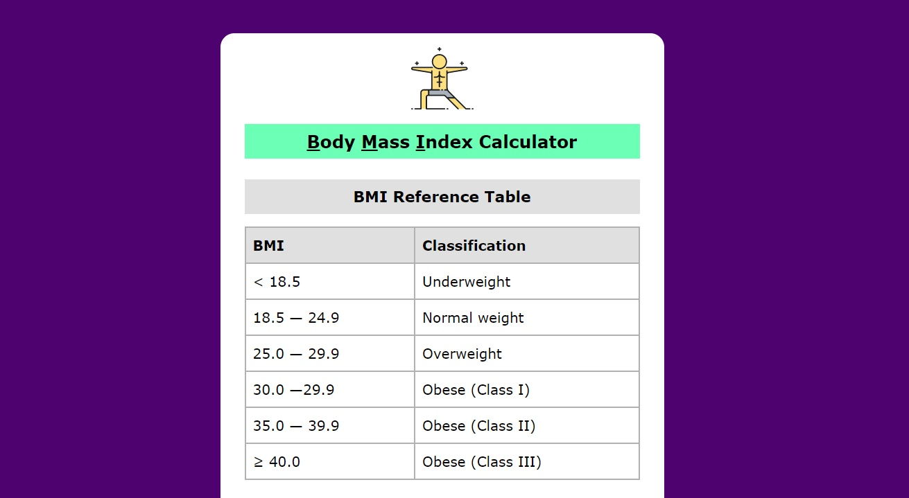
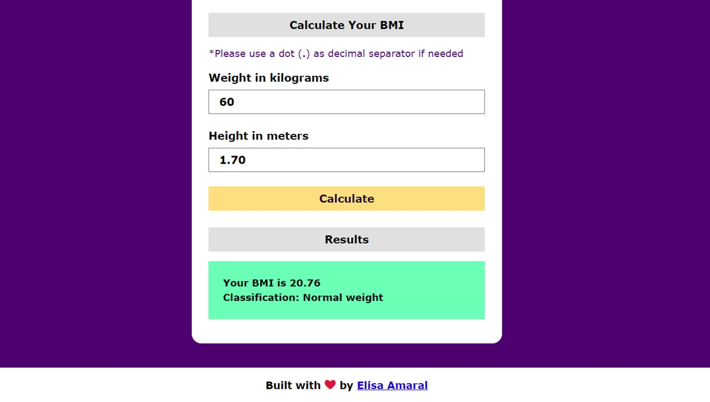

# Body Mass Index Calculator

This project is Body Mass Index Calculator coded in HTML, CSS and JavaScript (Vanilla JS), it calculates the Body Mass Index (BMI) based on the standard BMI reference table that uses the weight in kilograms and height in meters to generate the results.

## Project Link

**https://bmi-calculator-built-with-javascript.netlify.app/**

## Screenshot 1

## Screenshot 2

## Technology Stack

+ HTML
+ CSS
+ JavaScript (Vanilla JS)
